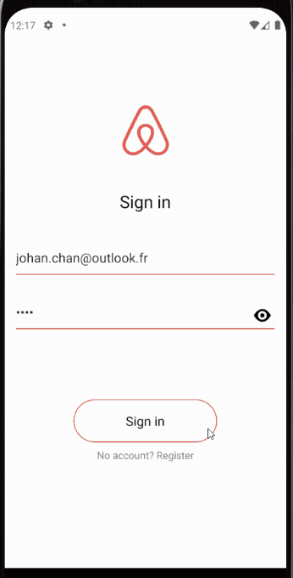
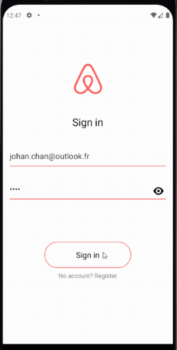
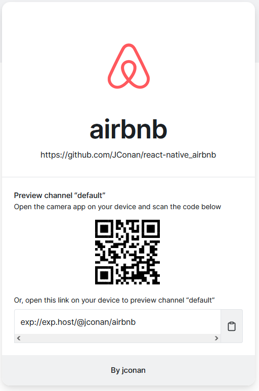

# Airbnb Clone - React Native

## Demo

### Description

Airbnb is theme of this demo app and is being used to help me learn more about React Native with Expo.

Here are the key package I learn the most:

| package             | usage                                                                  |
| ------------------- | ---------------------------------------------------------------------- |
| react-hook-form     | build controlled inputs in SignIn/SignUp screens                       |
| zod                 | validate user inputs in SignIn/SignUp screens                          |
| @react-navigation   | provide screen navigation features                                     |
| expo-location       | retrieve GPS location data from mobile                                 |
| expo-image-picker   | to pick image from mobile media library and take photo with its camera |
| lottie-react-native | use to create animated loader                                          |

---

### [expo.dev](https://expo.dev/@jconan/airbnb)

I have also learn a lot about expo and a glimpse of what we could do with it. Here you can test the application after installing 'expo go' on your mobile.

## 
